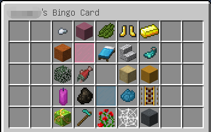

# Bingo!

Bingo plugin in Minecraft, inspired by [MetriCfan/Bingo](https://github.com/MetriCfan/Bingo/wiki).

# Requirement

This plugin requires 1.17 Spigot servers (forks such as Paper are fine).
